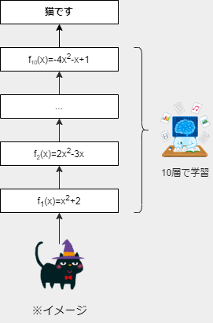

<!--
_class: title
-->

# ディープラーニングのすごさを共有したい

---
<!--
paginate: true
class: slides
-->

# おしながき

- ディープラーニングとは
- 学習の仕方：微分とか出てくる
    - 誤差逆伝播法
    - 勾配降下法
- 勾配消失問題
- 活性化関数ReLUのすごさ(ゴール！)

---
<!--
_class: semititle
-->

# ディープラーニングとは

---
# ディープラーニングとは

- コンピュータが人間並のことをできるようになる学習方法
    - コンピュータ：知識0常識0だが、めちゃポテンシャル高い
- 上手に学習させた結果：多様な **AI(人工知能)** を実現
    - 画像認識、機械翻訳、検索、要約、レコメンド、自動運転、物体検知、画像生成、音声認識、、、
     
- 余談：画像生成界隈、ガチで22年が転換点かもしれん
    - 22年8月：ヤバめのText-to-Imageが複数出現
        Midjourney, Stable Diffusion, DALL·E 2
    - 22年9月：Text-to-Video、Text-to-3D、Text-to-Audioが1日して揃う

---
# AI：数学的にはただの関数
## 何かを入力→内部で変換→何かを出力

以下の二つともやっていることは一緒
- $f(x) = 2x$
    入力したものを2倍にして返す
- 画像分類の例(右図)
    入力した画像を何らかのカテゴリーに分ける

---
# 学習と推論

- **学習**：良い関数を見つけること
    1. 「良さ」を決める
    その関数がどれくらい良い関数なのかを評価できるようにする
    →評価関数、目的関数
    2. 使う関数を決める
    無数にある関数の中から、ある程度大枠を決めておく
    ex) 2次関数にしよう→$f(x) = ax^2+bx+c$
    3. 良い関数を探す
    ex)良さが最大になるように二次関数のa,b,cを決める
- **推論**：見つけた関数を使うこと

---
# 深層の真相
## 複雑な関数を、単純な関数の積み重ねで表現する

- ex)2次関数を2個つなげると4次関数に
    $f_1(x) = x^2+2$と$f_2(x) = 2x^2-3x$をつなげる
    $f_2(f_1(x))=2(x^2+2)^2-3(x^2+2)$
    →10個つなげたら$2^{10}=1024$次関数に

---
<!--
_class: semititle
-->

# 学習の仕方

---
# aaa

---
# 参考

- [『本質をとらえたデータ分析のための分析モデル入門』](https://www.socym.co.jp/book/1377)
- 画像生成系の情報
    - [界隈の人のツイート](https://twitter.com/alfredplpl/status/1575601050135863296)
    - [Text-to-Video](https://makeavideo.studio/)
    - [Text-to-3D](https://dreamfusionpaper.github.io/)
    - [日刊 画像生成AI](https://note.com/yamkaz/all)
- [ニューラルネットワークの数学（逆伝播）](https://free.kikagaku.ai/tutorial/basic_of_deep_learning/learn/neural_network_basic_backward)
- [勾配消失問題とは？](http://marupeke296.com/IKDADV_DL_No6_vanishing_grad_prob.html)