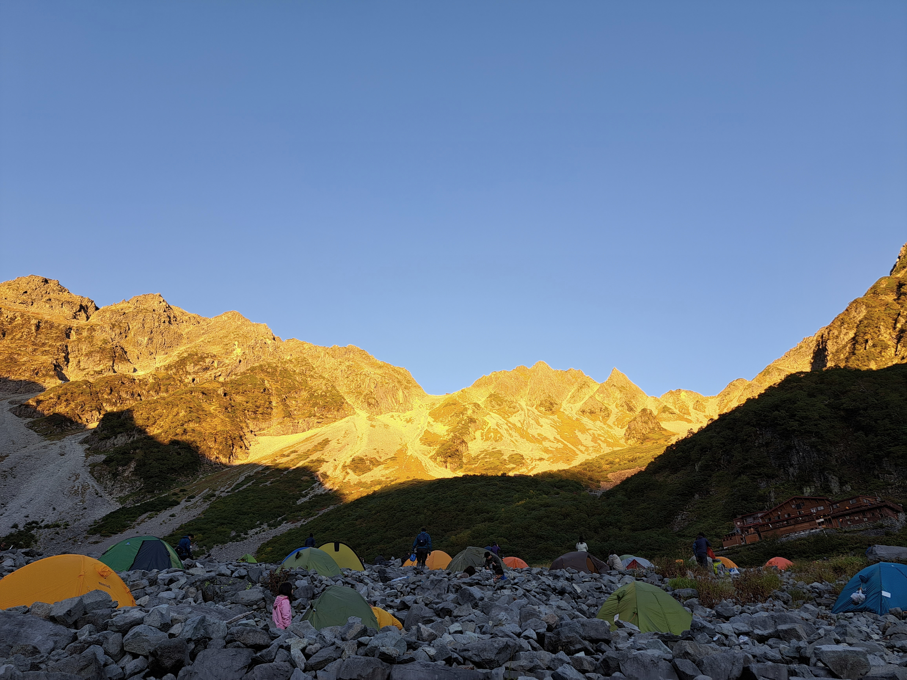
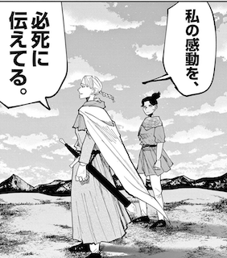
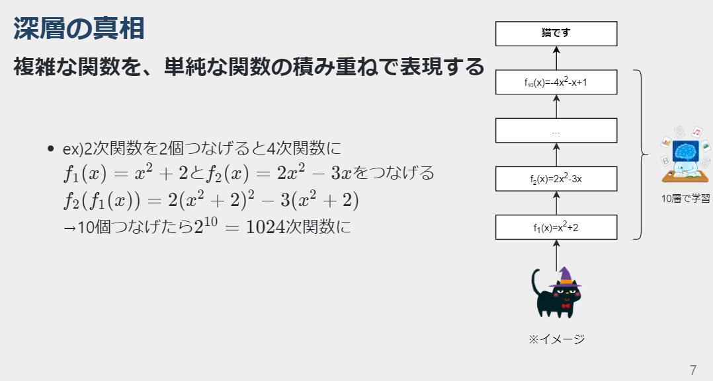

<!--
_class: title
footer: by @tree__and__tree
-->

# ディープラーニングのすごさを共有したい
~活性化関数ReLUについて~

---
<!--
paginate: true
class: slides
-->

# おしながき

<!--  -->

- ディープラーニングとは
- 学習の仕方
- 勾配消失問題
- 勾配消失問題の解決(ゴール！)

---
<!--
_class: semititle
-->

# ディープラーニングとは

- **ディープラーニングとは**
- 学習の仕方
- 勾配消失問題
- 勾配消失問題の解決(ゴール！)

---
# ディープラーニングとは

- コンピュータが人間みたいなことをできるようになる学習方法
    - コンピュータ：知識0常識0だが、めちゃポテンシャル高い
- 上手に学習させた結果：多様な **AI(人工知能)** を実現
    - 画像認識、機械翻訳、検索、要約、レコメンド、自動運転、物体検知、画像生成、音声認識、AlphaGo、、
- 余談：画像生成界隈、ガチで22年が転換点ぽい
    - 22年8月：ヤバめのText-to-Imageが複数出現
Midjourney, Stable Diffusion, DALL·E 2
    - 22年9月：Text-to-Video、Text-to-3D、Text-to-Audioが出現
    - 22年10月：Text-to-Image、爆速で発展
    NovelAIの登場、Stable Diffusionは各地でカスタマイズ化

---
# AI：数学的にはただの関数
## 何かを入力→内部で変換→何かを出力

以下の二つともやっていることは一緒
- $f(x) = 2x$
    入力したものを2倍にして返す
- 画像分類の例(右図)
    入力した画像を何らかのカテゴリーに分ける

---
# 学習と推論

- **学習**：良い関数を見つけること
    1. 「良さ」を決める
    その関数がどれくらい良い関数なのかを評価できるようにする
    →評価関数、目的関数
    2. 使う関数を決める
    無数にある関数の中から、ある程度大枠を決めておく
    ex) 2次関数にしよう→$f(x) = ax^2+bx+c$
    3. 良い関数を探す：後で詳しく
    ex)良さが最大になるように二次関数のa,b,cを決める
- **推論**：見つけた関数を使うこと

---
# 深層の真相
## 複雑な関数を、単純な関数の積み重ねで表現する

- ex)2次関数を2個つなげると4次関数に
    $f_1(x) = x^2+2$と$f_2(x) = 2x^2-3x$をつなげる
    $f_2(f_1(x))=2(x^2+2)^2-3(x^2+2)$
    →10個つなげたら$2^{10}=1024$次関数に

---
<!--
_class: semititle
-->

# 学習の仕方

- ディープラーニングとは
- **学習の仕方**
- 勾配消失問題
- 勾配消失問題の解決(ゴール！)

---
# 学習の流れ

1. パラメータの初期値をランダムに決定
2. そのパラメータで計算して予測値$y$を出す
3. 予測値$y$を正解$t$と比べて評価する
    目的関数に$y, t$を入れ、良さor悪さを出す
4. 目的関数の値をより大きくor小さくするためにパラメータの値を更新する
    **←ここをさらに詳しく**
5. 2-4を繰り返し、パラメータの値を最適化する
    パラメータの最適化＝目的関数が一番大きいor小さい

---
# パラメータを更新：勾配降下法

### こんな例で考えてみる
- 目的関数：$\Phi(y)=(y-t)^2$
    - 誤差が小さいほど予測値と正解が近い(良いモデル)
    →$\Phi(y)$を小さくするようにパラメータを更新
- 具体的に...
    - $y>t$のとき：$y$を小さくする
    - $y<t$のとき：$y$を大きくする
    →$y_{new}=y-α*\phi'(y)$ のようにすれば良い
    ($α$は学習率、勾配をどれくらい反映させるかを決める)
- 誤差を、勾配(微分)を使って小さく(降下)させている！

---
# モデルのパラメータを更新

### 誤差逆伝播法 
モデルのパラメータを出力に近い層から更新していく 
### こんな例で考えてみる
- 2層でできたモデル
- 更新するパラメータ：$a,b$

---
# モデルのパラメータを更新

### こんな例で考えてみる
- 入力$x=2$
- 正解$t=10$
- パラメータの初期値
    - $a=2$
    - $b=1$
###### $a,b$を更新して、$y$を$t$に近づけたい！

---
# モデルのパラメータを更新

- 予測値の更新：
    $y_{new}=y-α*\phi'(y)(yの勾配)$
    $y=bx_1+3=b(ax+5)+3$
    →パラメータ$a,b$を更新すれば、予測値$y$も更新される
- パラメータの更新：それぞれの勾配を使う
    - $b_{new}=b-α_b*\phi'(y)(bの勾配)$
    - $a_{new}=a-α_a*\phi'(y)(aの勾配)$
    →全部$\phi'(y)$？？
###### 偏微分：その関数を、色々な変数で微分する
$y$を$a$で微分：$\frac{\partial y}{\partial a}$、$y$を$b$で微分：$\frac{\partial y}{\partial b}$

---
# モデルのパラメータを更新
### $b$の更新

- $b_{new}=b-α_b*\frac{\partial \phi}{\partial b}$
    $=b-α_b*\frac{\partial \phi}{\partial y}*\frac{\partial y}{\partial b}$
    $=b-α_b*2(y-10)*x_1$
- 代入すると、、、
    $b_{new}=1-α_b*2(12-10)*9$
    $=1-α_b*36$

---
# モデルのパラメータを更新
### $a$の更新

- $a_{new}=a-α_a*\frac{\partial \phi}{\partial a}$
    $=a-α_a*\frac{\partial \phi}{\partial y}*\frac{\partial y}{\partial x_1}*\frac{\partial x_1}{\partial a}$
    $=a-α_a*2(y-10)*b*x$
    ←微分の数増えた！
- 代入すると、、、
    $a_{new}=2-α_a*2(12-10)*1*2$
    $=1-α_a*8$

---
# モデルのパラメータを更新

### ポイント
- 勾配(微分)を使って、目的関数の値を良くするように更新している
- 出力に近い層のパラメータから順番に更新される
- 層をたくさん重ねると、、、
    **入力に近い層は微分をたくさんしないと更新できない！**

---
<!--
_class: semititle
-->

# 勾配消失問題

- ディープラーニングとは
- 学習の仕方
- **勾配消失問題**
- 勾配消失問題の解決(ゴール！)

---
# 線形変換と非線形変換

- 線形変換：1次関数
- 非線形変換：それ以外の関数(2次関数も非線形)
    **活性化関数**と呼ばれている

###### 各層の中で線形変換→非線形変換を行っていることが多い

---
# 勾配消失問題

- 第1層のパラメータ更新のイメージ
    $a_{1new}=-α_1*\frac{\partial \phi}{\partial y}*w_2*...w_n*A_2'*A_3'*...*A_n'$
    →活性化関数($A$)の微分が大量に並ぶ
- $A$が全部1未満だと、、、
    掛け算するほど$a_{1new}$は小さくなってしまう
    →更新するとほぼ0になり、上手く学習できない

---
# 勾配消失問題

### 従来の活性化関数
※2010年代前半くらいまでの主流
- シグモイド関数
- tanh関数
###### どちらも微分値が1以下しか取らない
→層をたくさん重ねると、勾配消失問題が発生して上手く学習できない

---
<!--
_class: semititle
-->

# 勾配消失問題の解決(ゴール！)

- ディープラーニングとは
- 学習の仕方
- 勾配消失問題
- **勾配消失問題の解決(ゴール！)**

---
# 勾配消失問題を解決する関数

- **ReLU：Rectified Linear Units**
    $y= \left \{
    \begin{array}{l}
    x　(x>0のとき) \\
    0　(x\leq0のとき)
    \end{array}
    \right.$
    - 入力がプラスならそのまま出力
    - 入力がマイナスなら0で出力
###### めっちゃシンプル！
---
# 勾配消失問題を解決する関数

- 第1層のパラメータ更新のイメージ(再び)
    $a_{1new}=-α_1*\frac{\partial \phi}{\partial y}*w_2*...w_n*A_2'*A_3'*...*A_n'$
- 活性化関数にReLUを使うと、$A$の部分が**全部1**になる
    →**層を深くしても、上手く学習できる！！**
---
# ディープラーニングの夜明け
- AlexNet(2012)：画像処理のコンペにて、既存手法に対して圧倒的な精度差で勝利したモデル
    全8層からなる
###### この頃からとてつもない技術発展がはじまっていく—
- VGGNet(2014)：全19層。様々なモデルに応用されるベース的な立ち位置に
- GoogLeNet(2015)：全22層。情報を圧縮し効率化に成功
- ResNet(2015)：全152層。今までと段違いの深さになった
- Transformer(2017)：自然言語処理分野でのブレイクスルー。話題の画像生成分野でも使われている
- BERT(2018)：Transformerを活用したモデル。少しのデータで良いモデルが作れる
---
# 参考

- [『本質をとらえたデータ分析のための分析モデル入門』](https://www.socym.co.jp/book/1377)
- [ニューラルネットワークの数学（順伝播）](https://free.kikagaku.ai/tutorial/basic_of_deep_learning/learn/neural_network_basic_forward)
- [ニューラルネットワークの数学（逆伝播）](https://free.kikagaku.ai/tutorial/basic_of_deep_learning/learn/neural_network_basic_backward)
- [勾配消失問題とは？](http://marupeke296.com/IKDADV_DL_No6_vanishing_grad_prob.html)
- [畳み込みニューラルネットワークの最新研究動向 (〜2017)](https://qiita.com/yu4u/items/7e93c454c9410c4b5427)
- [シグモイド関数の意味と簡単な性質](https://manabitimes.jp/math/790)
- [tanhの意味、グラフ、微分、積分](https://mathwords.net/haipaborictan)
- [ディープラーニング(Deep Learning)の歴史を振り返る](https://tjo.hatenablog.com/entry/2020/08/16/153129#fn-901c5fa1)
 
- [GeoGebra](https://www.geogebra.org/graphing?lang=ja)：関数描画に使用
---
# 参考(画像生成系)
- [MIdjourney](https://www.midjourney.com/home/)
- [Stable Diffusion](https://github.com/CompVis/stable-diffusion)
- [DALL·E 2](https://openai.com/dall-e-2/)
- [Text-to-Audio](https://felixkreuk.github.io/text2audio_arxiv_samples/)
- [Text-to-Video](https://makeavideo.studio/)
- [Text-to-3D](https://dreamfusionpaper.github.io/)
- [日刊 画像生成AI](https://note.com/yamkaz/all)
- [NovelAI](https://novelai.net/)